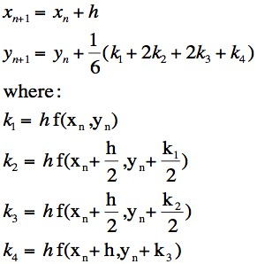

# Pendulum simulations using the Runge-Kutta 4th Order Method to Solve Differential Equations

RK4 for accurate calculations and floating-point error reduction.



## Useage
```sh
cd double
dub run
```

